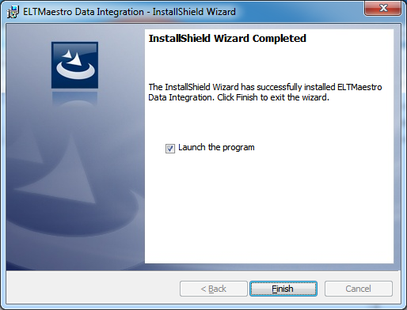

# Client

Integrator is a tool that helps you do data integration and build data
warehouses on powerful platforms such as IBM PureData for Analytics
(Netezza), Amazon RedShift, and other systems. This manual covers the
installation of Integrator Client on local windows sytem.

## Installation Steps

-   Obtain a copy of Integrator Design Studio Client.

-   Run Client\_\<YOUR PLATFORM\_NAME\>.exe executable program.

-   Click \[Next\]

-   Make sure you accept the terms by clicking I accept radio button.
    Then click \[Next\].

-   Optionally add User Name and/or Organization. Then Click \[Next\]

-   Click \[Next\] to continue. You may also change default installation
    directory by clicking \[Change\]

-   Click \[Install\]

-   Click \[Finish\]

**Note** that for first time users the default credentials are as
follows.

Server: Integrator Server Host Name

Port: 8181

User Name: Integrator

Password: Integrator

**The default password for Integrator EC2 instance is the EC2
Instance-ID.**

Please refer to Initial Configuration Guide for user
administration(creating new users, changing passwords etc..)
