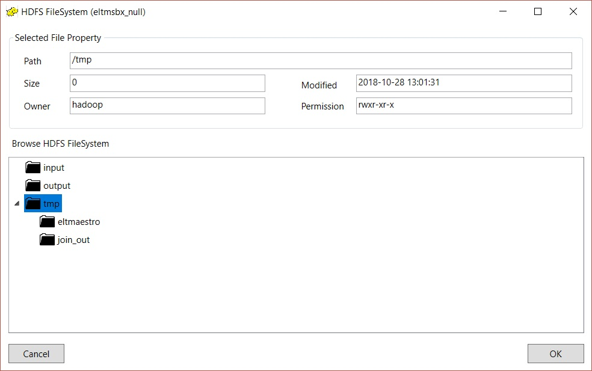

# Your First Job

In this example we build a simple job that performs an inner join on two tables and writes the result to a parquet file.

## Prerequisites

-   Installed sandbox.

-   Installed client.

##  Building the example

- Log in to the sandbox.

- In the Workspace window, click on the pencil icon to create a new job.

- In the Job Creation window, make sure the Job Type is set to HADOOP-SPARK, name the job SPARK-JOIN, and click OK.

- In the Job Configuration Options window, change the value of $SPARK_ENGINE_PARTITION from 32 to 16, and click OK/Save.

We are now focused on the window where you will build and run the job.  The large empty area of the window is the *canvas*, and the
area on the left with the labeled icons (Onstage, Parquetfile, Filereader, etc.) is the *pallette*.  You construct jobs by dragging
*steps* from the pallete to the canvas, setting their properties, and connecting them with *flow lines*.

- Drag an *Onstage* step onto the canvas, and open its properties window by double-clicking on it.

The Onstage step is usually used to import external relational data (e.g. databases) into Integrator via a *connection*.  In the case
of the sandbox, we have provided a small database and a preconfigured connection named DVD_RENTAL_DATABASE_LOCAL for you to experiment
with.

- Set the *Connection* drop-down box to DVD_RENTAL_DATABASE_LOCAL.  Next to the *Catalog* box, click Browse.

- In the Browse dialog, there are three columns: Catalog, Schema, and Table.  In the Catalog column, select dvdrental.  In the Schema
column, select public.  In the Table column, select actor.  Click OK.

- The Onstage properties window should now look like the picture above.  Click OK.

- Drag a second Onstage step onto the canvas, and repeat the steps above, except this time, instead of the *actor* table choose the
*film-actor* table.  Your canvas should now look like the picture above:

- Drag a *Join* step onto the canvas.

- Connect the Onstage steps to the Join step as follows:  Clicking in the small grey box at the upper right of the Onstage step, hold down
the left mouse button while dragging the mouse to the Join step.  When the mouse is inside the Join step, release the left mouse button.  Repeat the
process for both Onstage steps.

- Double-click on the Join step to open up its properties page.

- In the Sources box, click on $4.(public.actor).  Four columns will appear in the Columns box.

- Select the four columns, and click on the Add to Output box.  A dialog box will appear that says "Total Number Of Columns Added: 4".  Click OK.

- In the Sources box, click on $5.(public.film_actor).  Three columns will appear in the Columns box. Click on the middle column, $5.film_id.  Then
click on Add To Output.  Click OK in the resulting dialog box.

- Now go to the section marked "Join Condition(s).  Set the First Join Source drop-down box to $4.

- Click on the Add button.  Three new boxes will appear, labeled Type, Join With, and ON.  Set the Join With drop-down box to $5.

- Click on the box the says Expr, which will cause the Expression dialog to appear.  In the COLUMN drop-down box, select $4.actor_id.  Then type "="
(without quotes).  Then select $5.actor_id from the COLUMN drop-down box.  The Expression dialog should now look like the picture above.  Click OK.

- The Join properties dialog should now look like the picture above.  Click OK, to return to the Designer Window.

- Drag a Parquetfile step onto the canvas, and connect the Join step to it.

- Double-click on the Parquetfile step to open up the Parquetfile properties window.  In the File Type radio button set, choose Create.  Then, next to
the box labeled HDFS Path, click Browse.

- This will bring up another dialog called HDFS FileSystem.  In the box labeled Browse HDFS FileSystem, click on the folder labeled tmp. Then click OK.

- Back in the Parquetfile properties window, select the text \<enter filename here\> and replace it with join_out.  Then click on the button labeled Refresh.

- The Parquetfile properties window should now look like the picture above.  Click OK to exit the properties dialog.

- The mapping dialog for the mapping between the Join step and the Parquetfile step will appear.  It should look like the picture above.  Click OK/SAVE.

- In the main Job window, under the Debug menu, select Check Mapping.  The Message box should print a message: "Mapping Check OK".

- You are now ready to run the job.  Under then Run menu, select Run.

- In the resulting Runtime Configuration Dialog, click Run.

- Integrator will automatically enable Debugging mode.  Icons will appear next to each step, indicating what stage of processing they are at.  The hourglass
icon next to the Onstage steps indicates that they are importing data into Integrator.

- A few moments later, the green icon with the check mark indicates that the data has been successfully imported.  The Join step has also completed its work.
The hourglass icon next to the Parquetfile step indicates that data is now being written to the parquet file.

- Finally, the Parquetfile step also has a green check mark icon next to it, and the job run is complete.

- Disable debugging by selecting Enable Debugging under the Debug menu.  (It's currently checked; selecting it again will turn it off.)  The green check mark icons will disappear.

- Right-click on the Parquetfile step, and select Preview from the context menu.  Click OK in the resulting confirmation dialog.

- After a few moments, the Preview window appears with the results of the join.
